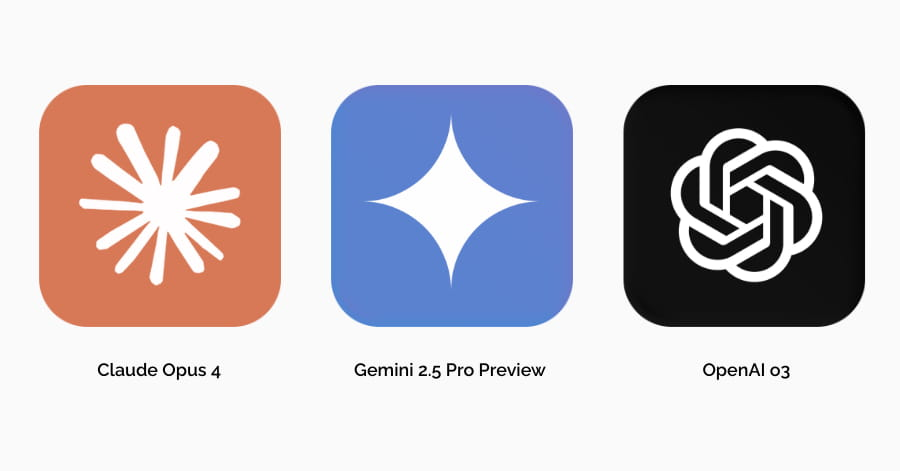

# attention-please

Plays a macOS ping and says: "Project NAME needs your attention."

## Install

### Codex

Clone into the Codex skills folder, then restart Codex:

```bash
git clone https://github.com/Mindgames/attention-please.git ~/.codex/skills/public/attention-please
```

### Claude Code / Claude CLI

Clone into the Claude skills folder, then restart Claude:

```bash
git clone https://github.com/Mindgames/attention-please.git ~/.claude/skills/attention-please
```

## Use

Run the script from the repo you want announced at the end of each run, or whenever input is needed:

```bash
~/.codex/skills/public/attention-please/scripts/attention-please.sh
```

If you installed for Claude, run:

```bash
~/.claude/skills/attention-please/scripts/attention-please.sh
```
